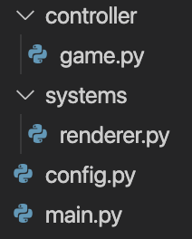

# Stage 1: Clearing the Screen
Games, get into them! We've all seen games and wondered how we, as mere trogladytes can glom onto such tecnical and artistic achievements. Well ponder no more, young grasshopper. As Einstein famously said: dreams are for dreamers, and game development is for the woke. Over the course of 24 stages, we're going to build a Wolfenstein clone, from scratch, using software rendering in Pygame.


In this stage we're going to clear the screen. A simple first step, but an important one.

## Folder Structure


Here is the basic structure we'll be constructing, as we add more to the program we'll be adding to it.

### Controller:
High level control code goes here, pretty much the main game.

### Systems:
A system is an object which consumes data and works on it each frame. Right now our renderer is the only system, but when we add more features like enemies and pickups they'll get their own systems.

### Config:
Pygame can't be imported multiple times. To get around this limitation we'll simply do all our third party imports in one place. This can then be imported multiple times by other modules without problems.

### Main:
To run the game simply run this file.

## Imports
Config is quite straightforward:

<config.py>:
```
import numpy as np
import pygame as pg
```

## Renderer
Let's start with the basic interface for the renderer

<systems/renderer.py>:
```
from config import *

class Renderer:

    def __init__(self, width: int, height: int):
        
        pass
    
    def update(self):
        
        pass
```

Now let's flesh out the initializer:

```
pg.init()
self.screen_surface = pg.display.set_mode((width, height))
self.screen_pixels = pg.surfarray.array2d(self.screen_surface)
```

After initializing pygame, we construct two objects. PyGame's display.set_mode function sets the window size and also returns a pygame surface for us to use.
We also get a numpy array representing the surface. This is a two dimensional numpy array full of 32 bit integers, representing the surface. It can be written in a pretty intuitive way, eg.
```
my_color = my_surface.map_rgb(240, 20, 46)
screen_pixels[x][y] = my_color
```
the code above uses the surface's map_rgb function, this handles the job of converting (r,g,b) colors into integers. We could do this ourselves with some low-level code and bit shifting, but sometimes different surfaces will use different pixel formats, so letting the surface convert colors is more robust.

Anyway, let's make some colors to work with.
```
self.colors = (
    self.screen_surface.map_rgb(16, 16, 16), 
    self.screen_surface.map_rgb(128, 128, 128))
```

Here's the full initializer for reference:
```
def __init__(self, width: int, height: int):
    """
        Initialize a rendering engine.
        
            Parameters:
                width (int): width of screen
                height (int): height of screen
    """

    pg.init()
    self.screen_surface = pg.display.set_mode((width, height))
    self.screen_pixels = pg.surfarray.array2d(self.screen_surface)

    self.colors = (
        self.screen_surface.map_rgb(16, 16, 16), 
        self.screen_surface.map_rgb(128, 128, 128))
```

Before we can draw the frame we'll need a function to clear the screen. This function will be defined outside of the class, so that if necessary they can be compiled.

```
def clear_screen(color_buffer: np.ndarray, color: int) -> None:
    color_buffer &= 0
    color_buffer |= color
```
One of the cool things about numpy arrays is that we can apply bitwise logic to them and it's automatically vectorized. Here we zero out the given numpy array and then replace it with the given color.

We can now fill in the renderer's update function:
```
def update(self):
    """
        Draws a frame
    """

    clear_screen(self.screen_pixels, self.colors[0])
        
    pg.surfarray.blit_array(self.screen_surface, self.screen_pixels)
    pg.display.flip()
```

Firstly we use the clear_screen function we wrote to flush out the screen pixels, then we upload the screen pixels to the surface. For purposes of synchronization it's probably not a good idea to modify an array while pygame is presenting it to the screen. We finally flip Pygame's display, updating the screen.

## Game
Onto the game, here's the basic structure:

<controller/game.py>:
```
from config import *
from systems.renderer import Renderer

class Game:

    def __init__(self):
        pass
    
    def play(self):
        pass
    
    def quit(self):
        pass
```

This is enough for us to fill out the main file.

<main.py>:
```
from config import *
from controller.game import Game

myApp = Game()
myApp.play()
```

So now back to the game class! Here's the initializer:
```
def __init__(self):
    self.screen_width = 640
    self.screen_height = 480
    self.renderer = Renderer(self.screen_width, self.screen_height)
    self.clock = pg.time.Clock()
```

Pretty standard stuff, we store the screen size, make a renderer and a clock to measure our framerate.

With that out of the way we can look at the play function:
```
running = True
    while (running):
        #events
        pass
        
        self.renderer.update()

        #timing
        pass
    self.quit()
```

The event handling is the standard pygame event handling methodology. Here we're just going to break when the user tries to close the window.
```
#events
for event in pg.event.get():
    if (event.type == pg.QUIT):
        running = False
```

Then in the timing code we measure the framerate and display it in the window title.
```
#timing
self.clock.tick()
framerate = int(self.clock.get_fps())
pg.display.set_caption(f"Running at {framerate} fps.")
```

And that's it! Here's the full code for reference:
```
def play(self):

    running = True
    while (running):
        #events
        for event in pg.event.get():
            if (event.type == pg.QUIT):
                running = False
        
        self.renderer.update()

        #timing
        self.clock.tick()
        framerate = int(self.clock.get_fps())
        pg.display.set_caption(f"Running at {framerate} fps.")
    self.quit()
```

The quit function is quite simple, we just quit out of pygame.
```
def quit(self):
    pg.quit()
```

And that's it! In the next stage we'll be drawing vertical lines, and filling in the floor and ceiling. See you then!